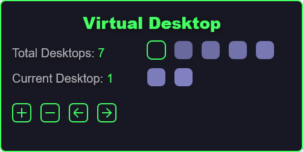

<h1 align="center">
  VirtualDesktop - Tool
  <br>
</h1>

<h4 align="center">
Example skin for someone who want to use it
</h4>

<p align="center">
  <a href="#"></a>
</p>

<h1></h1>

<p align="center"><i>*<b>WindowsVersion</b> is a <b>0</b> for <b>Windows 11</b> and a <b>1</b> for <b>Windows 10</b>.</i></p>

- **Desktop.lua Actions:**
  - Get Total Desktops (Num).
  - Get Current Desktop (Num).

- <details><summary>Code</summary>

  ```ini
  [&Measure_Script:GetDesktopCount()]
  [&Measure_Script:GetCurrentDesktop()]
  ```
  > This functions will return the value, so save it in a variable.
  ```ini
  [!SetVariable Temp_Desktop_Count "[&Measure_Script:GetDesktopCount()]"]
  ```
</details>
<h1></h1>

- **AHK/EXE Script Actions:**
  - Create Desktop.
  - Delete Desktop.
  - Previous Desktop.
  - Next Desktop.
  - Move To Desktop.

- <details><summary>Code</summary>

  ```ini
  ; Create New Desktop
  ["#@#Scripts\<WindowsVersion>\VirtualDesktop.exe" "CreateDesktop"]
  ; Delete Last Desktop
  ["#@#Scripts\<WindowsVersion>\VirtualDesktop.exe" "DeleteDesktop"]
  ; Go to Previous Desktop
  ["#@#Scripts\<WindowsVersion>\VirtualDesktop.exe" "PreviousDesktop"]
  ; Go To Next Desktop
  ["#@#Scripts\<WindowsVersion>\VirtualDesktop.exe" "NextDesktop"]
  ; Go To N Desktop
  ["#@#Scripts\<WindowsVersion>\VirtualDesktop.exe" "MoveToDesktop" "<NumberOfDesktop>"]
  ```
</details>
<h1></h1>

- **Script Structuration:**
  - LinkToDesktopIDS -> Name of measure that have all **Desktop Binary IDs**.
  - LinkToCurrentDesktop -> Name of measure that have the **Current Desktop Binary ID**.

- <details><summary>Code</summary>

  ```ini
  [MeasureScript]
  Measure=Script
  ScriptFile=#@#\Scripts\Desktop.lua
  LinkToDesktopIDS=Measure_Desktop_Count
  LinkToCurrentDesktop=Measure_Current_Desktop
  UpdateDivider=-1
  ```
</details>
<h1></h1>

- **What does Lua script need to work?**
- <details><summary>Code</summary>

  ```ini
  ;----------------------------------------------------------------------
  ; Measure for <LinkToDesktopIDS>
  ;----------------------------------------------------------------------
  [Measure_Desktop_Count]
  Measure=Registry
  RegHKey=HKEY_CURRENT_USER 
  RegKey=Software\Microsoft\Windows\CurrentVersion\Explorer\VirtualDesktops
  RegValue=VirtualDesktopIDs
  RegExpSubstitute=1
  Substitute="(.{32})":"\1 "

  ;----------------------------------------------------------------------
  ; Measures for <LinkToCurrentDesktop>
  ;----------------------------------------------------------------------
  ; This measure is needed to know what script use.
  [MeasureOSVersion]
  Measure=Plugin
  Plugin=SysInfo
  SysInfoType=OS_VERSION
  RegExpSubstitute=1
  Substitute=".*Windows 10.*":"1",".*Windows 11.*":"0"

  ; This measure is needed for Windows 10, no longer required for Windows 11.
  [Measure_Current_Session]
  Measure=Registry
  RegHKey=HKEY_CURRENT_USER 
  RegKey=Software\Microsoft\Windows\CurrentVersion\Explorer\SessionInfo
  OutputType=SubKeyList
  UpdateDivider=-1

  ; RegKey for Windows 10
  ; Registry_RegKey_Current_1=Software\Microsoft\Windows\CurrentVersion\Explorer\SessionInfo\[&Measure_Current_Session]\VirtualDesktops
  ; RegKey for Windows 11
  ; Registry_RegKey_Current_0=Software\Microsoft\Windows\CurrentVersion\Explorer\VirtualDesktops

  [Measure_Current_Desktop]
  Measure=Registry
  RegHKey=HKEY_CURRENT_USER
  RegKey=[#Registry_RegKey_Current_[&MeasureOSVersion]]
  RegValue=CurrentVirtualDesktop
  ```
</details>
<h1></h1>

- **Credits:**
  - [VirtualDesktopAccessor](https://github.com/Ciantic/VirtualDesktopAccessor) dll file by [Jari Pennanen/Ciantic](https://github.com/Ciantic).
